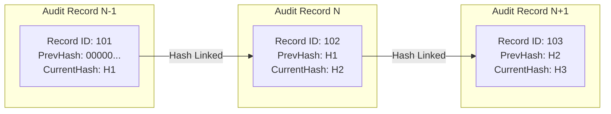

# Punjab Digital Community Supervision System (PDCSS)
## Audit Logging and Tamper-Evident Architecture

### 1. Purpose & Legal Compliance Scope
To satisfy Privacy & Security Requirements (#10: *Record every view, creation, update, deletion, export and administrative action in the audit system*), PDCSS implements a cryptographic, tamper-evident audit logging engine.

Audit logs serve as admissible legal evidence in court proceedings, internal administrative inquiries, and departmental reviews conducted by Audit Officers or the Home Department.

---

### 2. Tamper-Evident Cryptographic Hash Chaining Architecture

To prevent unauthorized modification, truncation, or deletion of audit logs (even by database administrators or compromised accounts), audit records are structured as an append-only cryptographic ledger using **HMAC-SHA256 Hash Chaining**.

#### Hash Calculation Formula
For each new audit log entry $N$:
$$\text{Payload}_N = \text{UserID} \parallel \text{Action} \parallel \text{TargetEntity} \parallel \text{TargetID} \parallel \text{Timestamp} \parallel \text{DiffJSON} \parallel \text{Hash}_{N-1}$$
$$\text{Hash}_N = \text{HMAC-SHA256}(\text{SecretKey}, \text{Payload}_N)$$

If any past row $K$ is altered or deleted, the hash chain validation routine fails at record $K+1$, alerting Audit Officers to database tampering.

---

### 3. Logged Events Catalog

1. **Authentication & Session Events**: Login success, login failure, token refresh, password reset, session revocation, device deregistration.
2. **Case & Profile Operations**: Supervisee registration, profile update, officer assignment, case transfer initiation/approval.
3. **Supervision & Check-Ins**: Check-in submission, photo upload, officer-assisted check-in, check-in verification status change.
4. **Assessments & Plans**: RNA creation/update, ISRP creation/update, referral logging.
5. **Violations & Disciplinary Actions**: Violation incident logging, supervisor approval, supervisor rejection, case status change.
6. **Data Exports & Views**: Viewing supervisee dossier (PDS view event), exporting PDF summary, exporting CSV report, judicial log export.
7. **System Administration**: User role assignment, office hierarchy modification, system setting updates.

---

### 4. Audit Log Access & Verification Tools
- **Read-Only Scoping**: Audit records are accessible only to users with `ROLE_AUDIT_OFFICER` and designated supervisory roles (scoped to their region).
- **Automated Chain Integrity Verification Routine**: A daily background task recalculates the hash chain across all `audit_logs` records. If a checksum mismatch is detected, a critical security alert is dispatched immediately to the Directorate Monitoring Officer and System Administrator.
