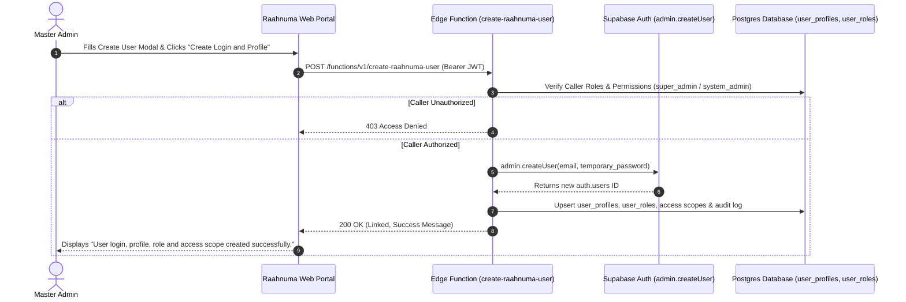

# Supabase Edge Function: `create-raahnuma-user`

**System**: Raahnuma - Punjab Community Supervision System  
**Organization**: Punjab Probation and Parole Service, Home Department, Government of the Punjab  
**Location**: `docs/backend/supabase_edge_function_create_raahnuma_user.md`  
**Edge Function Code**: `supabase/functions/create-raahnuma-user/index.ts`  

---

## 1. Overview & Purpose

The `create-raahnuma-user` Edge Function enables authorized Master Administrators (`super_admin` or `system_admin`) to provision new officer accounts directly from the Raahnuma Management Portal interface.

It automates the multi-step account creation sequence:
1. Validates caller JWT and RBAC privileges (`super_admin` / `system_admin` / `user_management.users.create`).
2. Provisions Supabase Auth login credentials (`auth.users`) with `email_confirm: true`.
3. Creates linked `public.user_profiles` records with officer type, designation, and masked identifiers.
4. Assigns role mapping in `public.user_roles`.
5. Grants district, division, and office access scopes (`user_district_access`, `user_division_access`, `user_office_access`).
6. Inserts immutable security audit logs in `public.user_activity_audit_logs`.

---

## 2. Deployment Instructions

### Prerequisites
- Install [Supabase CLI](https://supabase.com/docs/guides/cli):
  ```bash
  npm install -g supabase
  ```
- Link your project:
  ```bash
  supabase link --project-ref <your-supabase-project-id>
  ```

### Function Deployment
Deploy the Edge Function to Supabase:
```bash
supabase functions deploy create-raahnuma-user
```

---

## 3. Required Environment Variables & Secret Configuration

> [!CAUTION]
> **STRICT SECURITY RULE**: Never store or hard-code the `SUPABASE_SERVICE_ROLE_KEY` inside Flutter client code (`apps/web_portal` or `apps/officer_app`) or in Git repository source files. The service role key MUST remain strictly inside Supabase Function Secrets.

Set the service role key as a secret in Supabase:
```bash
supabase secrets set SUPABASE_SERVICE_ROLE_KEY="your-supabase-service-role-key"
supabase secrets set SUPABASE_URL="https://your-project.supabase.co"
```

The function automatically retrieves these secrets at runtime via `Deno.env.get('SUPABASE_SERVICE_ROLE_KEY')` and `Deno.env.get('SUPABASE_URL')`.

---

## 4. Master Admin User Creation Flow



---

## 5. Security Restrictions

1. **No Public Registration**: Public self-registration is disabled. All officer accounts must be created by a Master Admin.
2. **JWT Authorization**: Requests lacking a valid Bearer token return `401 Unauthorized`.
3. **Role Enforcement**: Callers without `super_admin` or `system_admin` authority return `403 Access Denied`.
4. **Duplicate Prevention**: Duplicate email or username requests return `400 Bad Request`.
5. **Officer Type & Role Alignment Warnings**: Mismatches between officer type (e.g. Probation Officer) and role code (e.g. parole_officer) generate advisory warnings in the API response.

---

## 6. Testing Checklist

- [x] 1. Deploy Edge Function `create-raahnuma-user`.
- [x] 2. Set environment secrets `SUPABASE_URL` and `SUPABASE_SERVICE_ROLE_KEY` in Supabase project dashboard.
- [x] 3. Launch Web Portal locally in Restricted Mode (`flutter run -d chrome --dart-define=RESTRICTED_MODE=true`).
- [x] 4. Log in as `admin@raahnuma.ppnps.gov.pk`.
- [x] 5. Open **User Management & Security Administration** screen.
- [x] 6. Click **Create User Account**, fill in officer details and temporary password, click **Create Login and Profile**.
- [x] 7. Verify green success notification: *“User login, profile, role and access scope created successfully.”*
- [x] 8. Confirm new user appears with `Auth Status: Linked` badge in Users table.
- [x] 9. Confirm new officer can successfully authenticate into Officer App using official email and temporary password.
