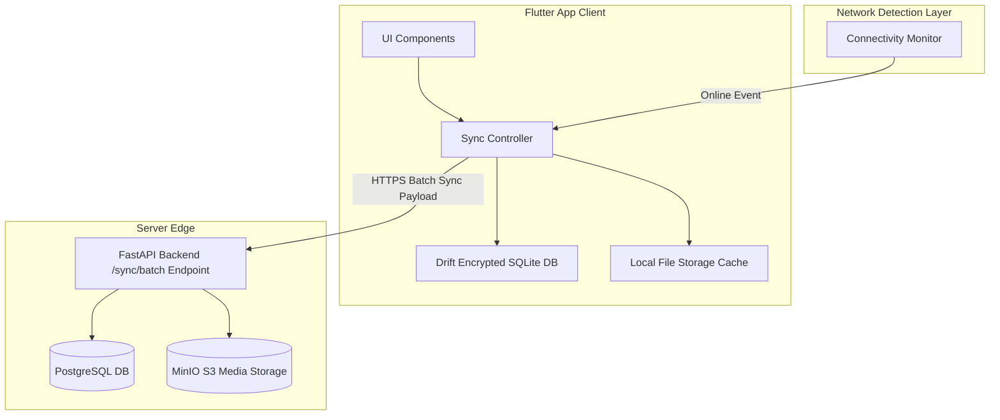

# Punjab Digital Community Supervision System (PDCSS)
## Offline Synchronisation and Storage Design

### 1. Offline Mobile Architecture Overview
In many rural Tehsils across Punjab, cellular data coverage is poor or intermittent. To ensure uncompromised reliability, both the Supervisee Android App and Officer Android App utilize an **offline-first local storage architecture** powered by **Drift (Type-safe Dart SQLite ORM)** with **SQLCipher binary encryption**.

---

### 2. Local Database Schema & Encrypted Storage
- **Storage Engine**: SQLite 3 with SQLCipher 256-bit AES encryption.
- **Key Storage**: Database encryption key is generated at first run and stored securely in Android Keystore via `flutter_secure_storage` (`EncryptedSharedPreferences`).
- **Local Tables**:
  - `local_checkins`: Stores offline check-ins (client UUID, timestamp, lat/long, photo local file path, sync status: `PENDING`, `SYNCING`, `SYNCED`, `FAILED`).
  - `local_field_contacts`: Stores officer field notes created offline.
  - `local_supervisee_cache`: Read-only cache of assigned probationer summary profiles for offline officer lookup.

---

### 3. Synchronization Protocol & Conflict Resolution

#### 3.1 Delta Synchronization Cycle
1. **Trigger**: Sync starts automatically upon connectivity detection (Wi-Fi/4G), or when manually initiated by pressing "Sync Now" in the app header.
2. **Payload Packaging**: Sync manager queries `local_checkins` for records where `sync_status = PENDING`.
3. **Chunking & Batching**: Photos are compressed (JPEG 85% quality, max dimension 1280px) and batched in chunks of 5 items per HTTP request to prevent memory spikes or timeout failures.
4. **Server Handshake**: Client POSTs batch payload to `/api/v1/sync/batch`.

#### 3.2 Idempotency & De-duplication
- Every offline check-in generated on the mobile app is assigned a client-side `UUID v4`.
- If a network failure occurs while receiving the server response, the client will re-send the batch upon retry.
- The backend checks `digital_checkins.id` (UUID). If the UUID already exists in PostgreSQL, the backend skips insertion and returns the previously generated receipt payload (`200 OK`).

#### 3.3 Conflict Resolution Rules
- **Check-ins & Receipts**: Client timestamp + hardware clock state recorded. The server validates that client timestamp falls within permissible bounds of server clock (*Requires PP&PS policy approval on allowable time skew*).
- **Officer Notes & Status Updates**: Server uses **Last-Write-Wins (LWW)** based on server receipt timestamp for operational notes, while maintaining immutable edit histories in audit logs.

#### 3.4 Client Submission Receipts
- Upon saving a check-in locally while offline, the mobile app immediately generates a **Local Pending Receipt** containing a local receipt code (e.g., `OFFLINE-REC-39201`).
- Once synced, the server responds with the **Official Verifiable Digital Receipt Code** (`REC-PDCSS-20260725-88392`) and HMAC signature, updating the local UI receipt card.
