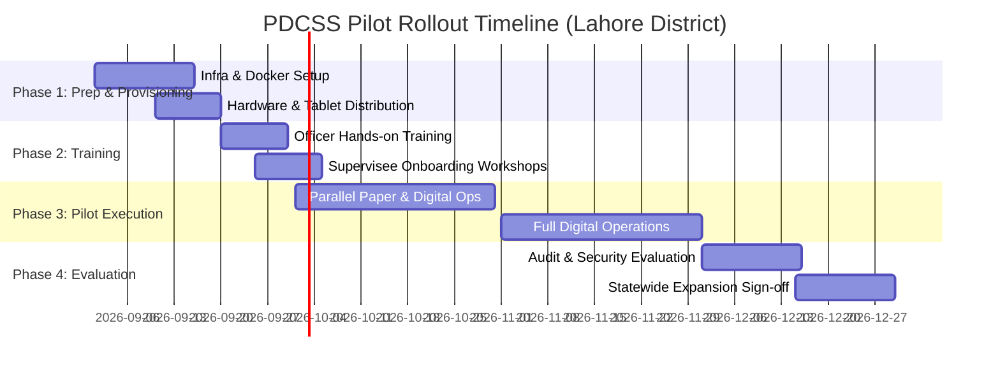

# Punjab Digital Community Supervision System (PDCSS)
## Pilot Implementation and Rollout Plan

### 1. Pilot Objectives & Location Selection
Before statewide deployment across all 36 Districts of Punjab, PDCSS will undergo a controlled 90-day pilot deployment in **Lahore District** (comprising Lahore City, Model Town, Shalimar, Cantt, and Raiwind Tehsils).

Lahore District provides an ideal pilot environment featuring dense urban supervision workloads, varied cellular network topologies, high case volumes (~3,000 active probationers/parolees), and proximity to PP&PS Directorate Headquarters.

---

### 2. Phased Rollout Schedule

---

### 3. Key Readiness & Operational Prerequisites

#### 3.1 Infrastructure & Hardware Provisioning
- **Server Deployment**: Staging and pilot production instances of Docker Compose container stack (FastAPI, PostgreSQL/PostGIS, Keycloak, MinIO, Nginx) deployed at PITB Data Center.
- **Officer Devices**: Distribution of 50 enterprise-managed Android smartphones (with rugged protective cases, pre-loaded PDCSS Officer App, and cellular SIM cards with dedicated APN) to Lahore Probation & Parole Officers.
- **Office Kiosks**: Installation of 5 officer-assisted check-in tablets at Lahore District Probation Headquarters for supervisees without smartphones.

#### 3.2 Change Management & Training Program
- **Officer Training**: 3-day intensive hands-on workshop covering registration, RNA/ISRP entry, violation review, and offline synchronization handling.
- **Bilingual User Guides**: Provision of printed and digital illustrated user manuals in Urdu and English for officers and supervisees.

#### 3.3 Success Evaluation Criteria for Statewide Expansion
1. **System Uptime & Reliability**: > 99.5% backend uptime during 60-day active pilot phase.
2. **Check-In Completion Rate**: > 85% successful digital check-in rate (self-mobile + officer-assisted) across pilot cohort.
3. **Offline Sync Integrity**: Zero data loss or corrupted check-in records during network dropouts.
4. **Officer Satisfaction Score**: > 80% positive feedback on Urdu interface usability and time savings compared to paper registers.
5. **Zero High-Severity Security/Privacy Incidents**: Clean audit log integrity report with zero unauthorized data views or location privacy breaches.
