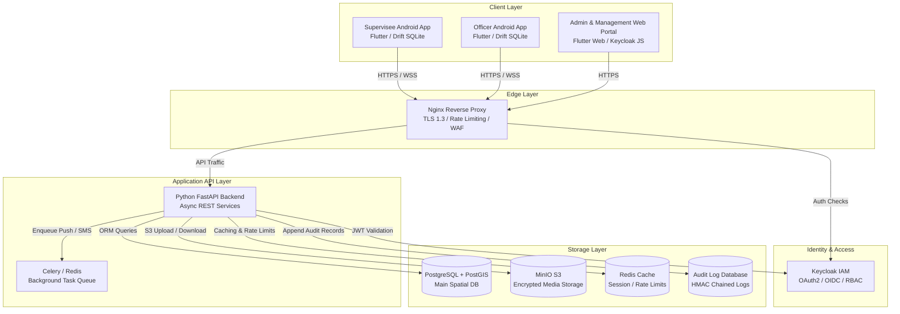
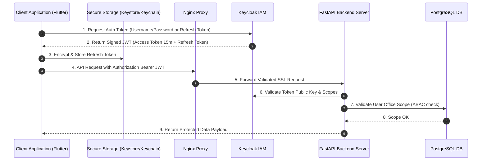
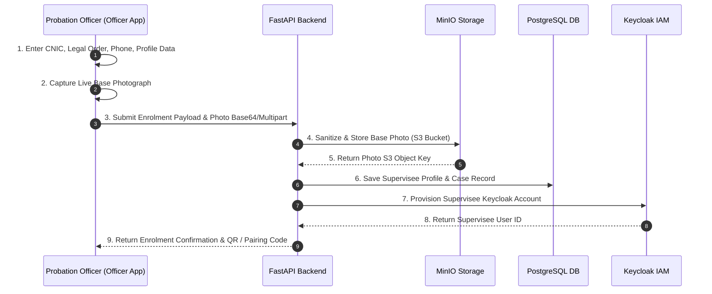
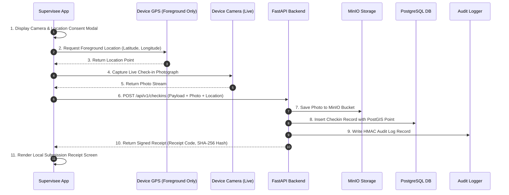
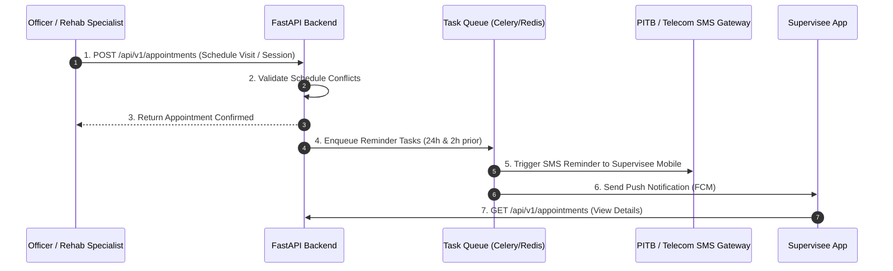
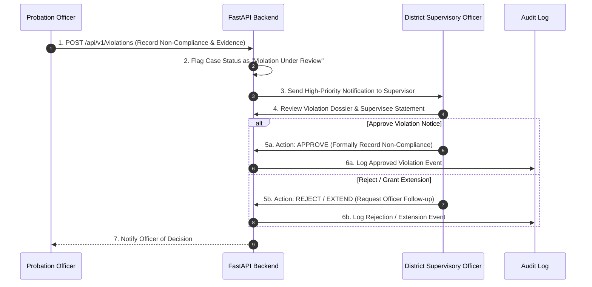
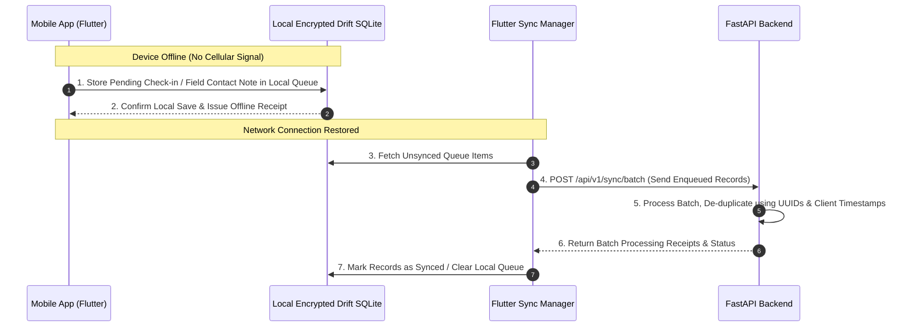
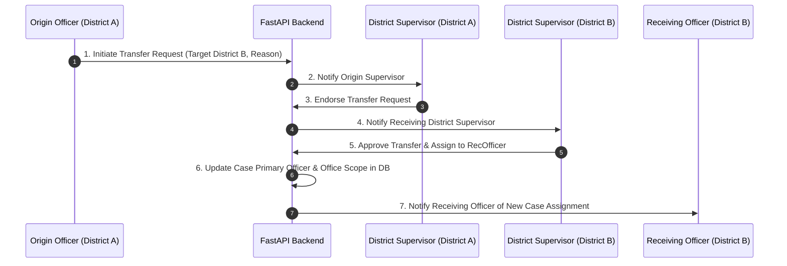

# Punjab Digital Community Supervision System (PDCSS)
## System Architecture Specification

### 1. Architectural Overview & Component Architecture

PDCSS follows a containerized, decoupled microservices-friendly architecture comprising client applications, API reverse proxy layer, core application services, identity management, storage engines, and immutable audit logs.

---

### 2. Core Workflow Mermaid Diagrams

#### Diagram 1: User Authentication Sequence

---

#### Diagram 2: Supervisee Enrolment Workflow

---

#### Diagram 3: Digital Check-In Sequence

---

#### Diagram 4: Appointment Workflow

---

#### Diagram 5: Violation Review Workflow (Human-in-the-Loop)

---

#### Diagram 6: Offline Synchronisation Mechanism

---

#### Diagram 7: Case Transfer Workflow

